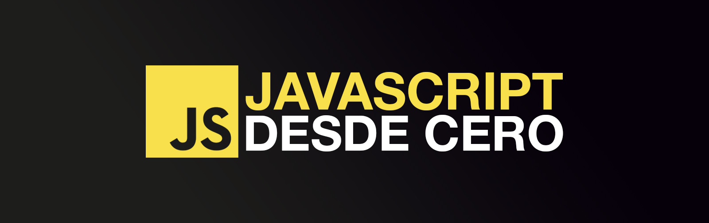

# Hello JavaScript

 

## Curso para aprender el lenguaje de programación JavaScript desde cero y para principiantes.

## Codigo

* [00 - Hola Mundo](./basic/00-helloworld.js)
* [01 - Variables](./basic/01-variables.js)
* [02 - Tipos de datos](./Basic/02-datatypes.js)
* [03 - Ejercicios: Primeros pasos](./Basic/03-beginner-exercises.js)
* [04 - Operadores](./Basic/04-operators.js)
* [05 - Ejercicios: Operadores](./Basic/05-operators-exercises.js)
* [06 - Strings](./Basic/06-strings.js)
* [07 - Ejercicios: Strings](./Basic/07-strings-exercises.js)
* [08 - Condicionales](./Basic/08-conditionals.js)
* [09 - Ejercicios: Condicionales](./Basic/09-conditionals-exercises.js)
* [10 - Array](./Basic/10-array.js)
* [11 - Set](./Basic/11-set.js)

## Enlaces de interés

* Impacto: [Stack Overflow](https://survey.stackoverflow.co/2023/#most-popular-technologies-language) | [GitHub](https://github.blog/2023-11-08-the-state-of-open-source-and-ai/) | [Índice TIOBE](https://www.tiobe.com/tiobe-index/) | [Google Trends](https://trends.google.es/trends/explore?cat=5&date=today%205-y&q=%2Fm%2F02p97,%2Fm%2F05z1_,%2Fm%2F07sbkfb&hl=es)
* [Historia](https://es.wikipedia.org/wiki/JavaScript)
* [Especificación ECMAScript](https://tc39.es/ecma262/)
* [Documentación Mozilla](https://developer.mozilla.org/es/docs/Web/JavaScript)
* [Documentación W3Schools](https://www.w3schools.com/js/)
* [Documentación JS Info](https://es.javascript.info/)
* [Libro Eloquent JavaScript](https://eloquentjavascript.net/)
* [Playground](https://runjs.app/play)
* [Node.js](https://nodejs.org)
* Exploradores: [Chrome](https://www.google.com/intl/es_es/chrome/) | [Brave](https://brave.com/download/)
* [Visual Studio Code](https://code.visualstudio.com/)
* [Guía de estilo](https://google.github.io/styleguide/jsguide.html)

##  Hola, mi nombre es Tarcisio Valentim.
### 💻 Fullstack Developer | iOS & Android | ReactJs | NodeJs.

Soy desarollador de software desde 2020. Desde 2018 combino mi trabajo desarrollando Apps con la creación de contenido formativo sobre programación.

Puedes encontrarnos en:

> ##### Si consideras útil el contenido, apóyalo haciendo "★ Star" en el repositorio. ¡Gracias!